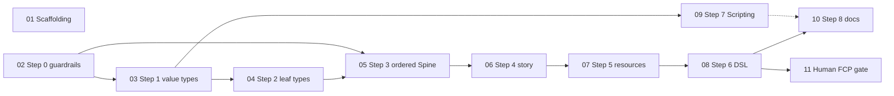

# v0.1.0 Worktree Plan

How to split the [v0.1.0 tickets](../../.scratch/v0.1.0/README.md) across
[`git-trees`](https://github.com/brightdigit/git-trees) worktrees so agents can
work in parallel without stepping on each other.

Ticket bodies: `.scratch/v0.1.0/issues/`. Source plan:
[v0.1.0-first-working-version.md](v0.1.0-first-working-version.md). Accepted as
[ADR 0002](../adr/0002-create-first-ordered-typed-model.md).

## Rules (repo layout)

From the FCPKit root `AGENTS.md`:

- One worktree per branch; create with `git trees add <name>` from the repo root.
- Stay inside your assigned worktree. Do not `cd` into a sibling or check out
  another branch in-place.
- Push with `git push -u origin HEAD`.
- Do not force-push, `git gc`, or rewrite shared history on branches you do not own.
- Integration branch for implementation: **`v0.1.x`**.

Planning docs currently live on `swift-package-plan`. Merge (or cherry-pick) that
branch into `v0.1.x` once before coding starts — not a ticket.

## Dependency graph



Solid edges are hard blockers. The dotted edge means docs wait on Scripting only
if Scripting ships in the same release.

## Parallel lanes

Only three code lanes earn their own worktree. Everything else is serial on the
model lane or human-only.

| Worktree | Branch | Issues | Starts when | Merges into |
| --- | --- | --- | --- | --- |
| `v0.1-scaffold` | `v0.1-scaffold` | **01** scaffolding | Immediately (after planning docs on `v0.1.x`) | `v0.1.x` |
| `v0.1.x` | `v0.1.x` | **02 → 08**, then **10** | Immediately for 02; then follow the chain | release / main when ready |
| `v0.1-scripting` | `v0.1-scripting` | **09** Scripting | After **03** is merged to `v0.1.x` | `v0.1.x` |

| No dedicated worktree | Issues | Notes |
| --- | --- | --- |
| Human machine + Final Cut | **11** | After 08 on `v0.1.x`; evidence in manual gate docs |
| Planning only | `swift-package-plan` | Keep for ADR/plan edits; not for Step 0–8 code |

### Why not more worktrees?

- **02–08 are a single chain.** Step 3 needs Step 2’s typed leaves; Step 4 needs
  ordered Spine; DSL needs the typed model. Splitting them across worktrees
  creates merge pain without wall-clock win.
- **05 (ordered Spine) must land alone** on the model lane — clean break, no
  shims, careful review. Do not stack unrelated PRs behind it on the same branch
  while it is open.
- **10 (docs)** belongs on `v0.1.x` after 08 (and 09 if same release), not a
  fourth long-lived tree.

## Phases

### Phase A — two agents now

| Agent | Worktree | Work |
| --- | --- | --- |
| A | `v0.1-scaffold` | Issue **01** |
| B | `v0.1.x` | Issue **02**, then **03** |

When **01** is green: open PR → merge into `v0.1.x` (rebase/merge as needed).
Scaffolding should land early so later PRs run under CI.

When **03** is on `v0.1.x`: Phase B unlocks.

### Phase B — three agents

| Agent | Worktree | Work |
| --- | --- | --- |
| A | `v0.1.x` | **04 → 05 → 06 → 07 → 08** (serial; **05** alone in its PR) |
| C | `v0.1-scripting` | **09** (branched from `v0.1.x` at/after 03) |
| — | — | Re-merge scaffold follow-ups if any |

Scripting only needs `FCPTime` / value types from 03. It must **not** edit
`Spine` or story element shapes that 04–07 own — if it must touch shared files,
coordinate or wait for the model PR that owns them.

### Phase C — close-out

| Who | Where | Work |
| --- | --- | --- |
| Agent | `v0.1.x` | Merge **09** if still open; issue **10** docs sync |
| Human | Final Cut host | Issue **11** import gate |

## Worktree setup

From the FCPKit repo root (parent of `v0.1.x` / `swift-package-plan`):

```sh
# Once: planning docs onto the integration branch (in v0.1.x worktree)
#   merge origin/swift-package-plan (or cherry-pick ADR/plan commits)

# Scaffold lane
git trees add v0.1-scaffold
# then in that worktree: branch from updated v0.1.x, implement 01, PR → v0.1.x

# Scripting lane — only after 03 is on v0.1.x
git trees add v0.1-scripting
# then in that worktree: branch from v0.1.x @ post-03, implement 09, PR → v0.1.x
```

Keep using the existing `v0.1.x` worktree for the model chain; do not create a
second tree for Steps 0–6.

## Merge protocol

1. **Base:** every lane branch starts from current `v0.1.x` (with planning docs).
2. **PR target:** always `v0.1.x` (not `main`, not `swift-package-plan`).
3. **Order of integration when conflicted:**
   1. Scaffolding (**01**) — prefer early
   2. Model chain PRs in step order (**02…08**); **05** never shares a PR with 04 or 06
   3. Scripting (**09**) — rebase onto `v0.1.x` after 05–07 if shared files drifted
   4. Docs (**10**) last among code
4. **Verify on `v0.1.x` after each merge:**
   ```sh
   swift test
   swift run fcpxml-diff schema-completeness Tests/FCPKitTests/TestData \
     --fail-if-total-exceeds 0
   ```
5. Agents claim one worktree / one open implementation issue at a time.

## Conflict hotspots

| Area | Owned by | Others |
| --- | --- | --- |
| `.github/`, lint/format, `Package.swift` metadata | **01** first; later lanes rebase | Model/Scripting only add products/targets |
| `Sources/FCPKit/Values/` | **03**, then consumers | Scripting may import; do not restructure |
| `Spine` / story / resources | **05–07** only | Scripting stays out |
| `Package.swift` products | **01** baseline; **08** adds `FCPKitDSL`; **09** adds `FCPKitScripting` | Rebase product diffs carefully |
| Docs (`AGENTS.md`, README, NEXT_STEPS) | **10** owns final sync | Earlier PRs may touch lightly; 10 reconciles |

## Frontier cheat sheet

| Ready now | Worktree |
| --- | --- |
| **01** Scaffolding | `v0.1-scaffold` |
| **02** Step 0 | `v0.1.x` |

| Unlocks after 03 on `v0.1.x` | Worktree |
| --- | --- |
| **04…08** model chain | `v0.1.x` |
| **09** Scripting | `v0.1-scripting` |

| Unlocks after 08 | Where |
| --- | --- |
| **10** Docs | `v0.1.x` |
| **11** Human gate | Final Cut machine |
